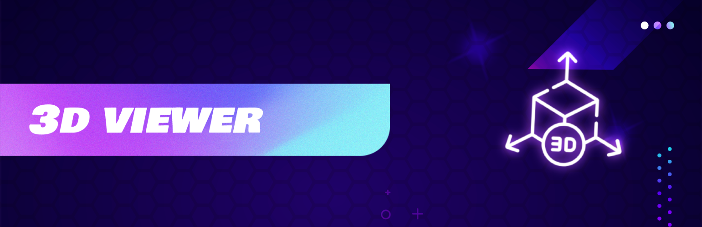
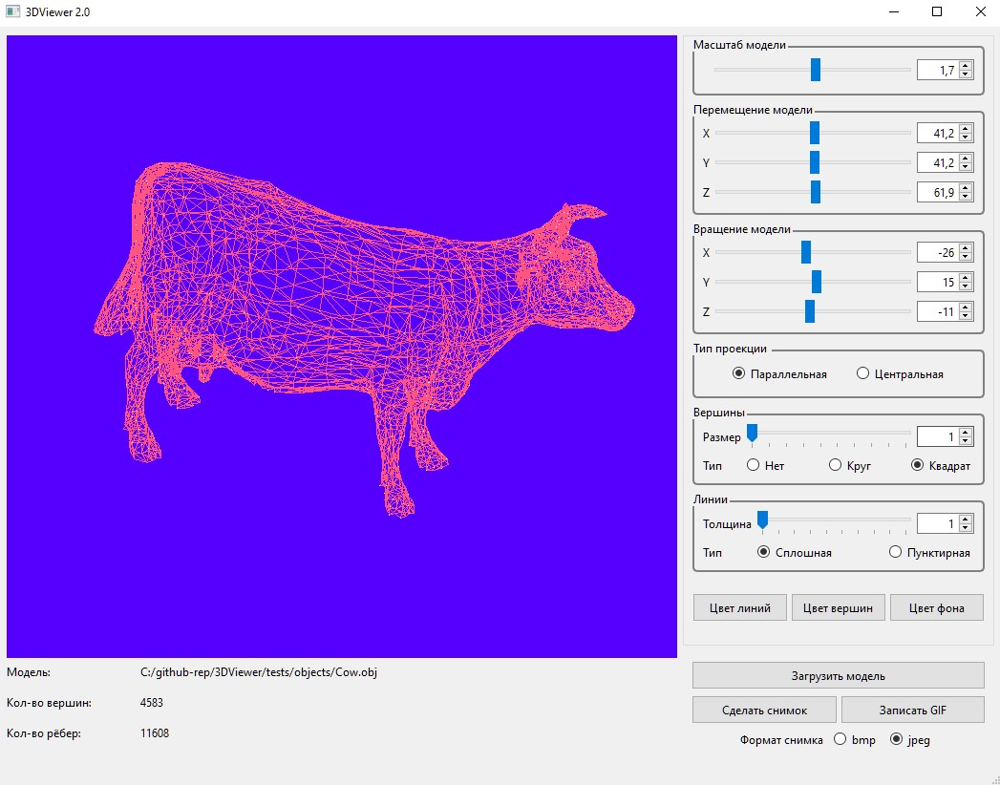

# 3DViewer

### Описание

Приложение для просмотра 3D моделей в каркасном виде.

### Сборка и установка

Для сборки и запуска программы необходимо установить библиотеку **QT4 или новее**.

Сборка осущетствляется в папке с исходными файлами с помощью команд **`make`** или **`make all`** или **`make install`**.

Исполняемый файл **3DViewer** после сборки будет находиться в папке *build*

### Возможности и компоненты

Приложение позволяет загружать каркасную модель из файла формата **`.obj`** c поддержкой только списка вершин и поверхностей.
Загруженную модель можно перемещать, поворачивать, а также масштабировать с помощью интерактивных "ползунков".
Приложение позволяет выбирать тип проекции (параллельная или центральная), тип, цвет и толщину ребер, а также форму отображения вершин (круг или квадрат), их цвет и размер.
Кроме того, приложение позволять выбирать цвет фона, а выбранные настройки сохраняются между перезапусками. 
Есть возможность сохранения изображений в файл формата **`.bmp`** или **`.jpeg`**.
Также есть возможность записи трансформаций модели в течение 5-секундного интервала в **`GIF-анимацию`** с параметрами **`640x480, 10fps`**.

### Элементы управления и ввода информации
В программе присутствуют следующие элементы управления и вывода информации:
  - Кнопка выбора файла с моделью и поле для вывода его названия.
  - Зона визуализации каркасной модели.
  - Слайдер и поле ввода для перемещения модели.
  - Слайдер и поле ввода для поворота модели.
  - Слайдер и поле ввода для масштабирования модели.
  - Поле с информацией о загруженной модели (название файла, количество вершин и ребер).
  - Поле выбора типа проекции.
  - Поле настройки отображения ребер.
  - Поле настройки отображения вершин.
  - Кнопки выбора цвета отображения для ребер, вершин и фона.
  - Кнопки для сохранения изображения в файл и записи скринкаста (GIF).
  - Поле выбора формата для сохранения изображения в файл (.bmp или .jpeg).

### Авторы
- https://github.com/dmnAlex
- https://github.com/dsnikitin
- https://t.me/Dr_eyo

